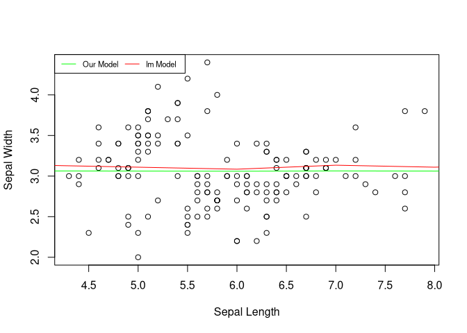

Implementing Linear Regression from Scratch
================
Sanjaya J Shetty
2022-06-29

## Theory

### The Formula for Linear Regression:

#### 


where,


So how do we calculate `a` and `b` ?

 * ( Y_i - \overline{y})}} {\sum{X_i - \overline{X}}} ")


## Implementing the formulaes

### Function to calculate the slope `b`

``` r
calcB = function(x,y){ 
  #' calculates the slope `b` for the equation `a+bx`
  #' The slope is calculated using the formula
  #' 
  #' math::
  #' $$ b = \frac{\sum{(X_i - \overline{X}) * ( Y_i - \overline{y})}} {\sum{X_i - \overline{X}}} $$
  #' 
  #' @param x the dependent variable
  #' @param y the independent variable
  #' 
  #' @returns A named vector, which includes slope, mean of X and Y variables
  #' 
  meanX = mean(x)
  meanY = mean(y)

  nemA = sum((x - meanX)*(y - meanY))
  denA = sum((x - meanY)^2)
  
  b = nemA/denA
  
  values = c(b, meanX, meanY)
  names(values) = c('b', 'meanX', 'meanY')
  return(values)
}
```

### Function to calculate the intercept `a`

``` r
calcA = function(x,y){
  #' Calculates intercept `b` for the equation `a+bx`
  #' The intercept is calculated using the formula
  #' 
  #' math::
  #' $$ a = \overline{y} - b * \overline{x} $$
  #' 
  #' @param x the dependent variable
  #' @param y the independent variable
  #' 
  #' @returns A named vector, which includes slope and intercept
  
  reqValues = calcB(x,y)
  
  b = reqValues['b']
  a = reqValues['meanY'] - (b * reqValues['meanX'])
  
  coeff = c(a,b)
  names(coeff) = c('a', 'b')
  return(coeff)
}
```

### Function to fit a linear regression line

``` r
linearRegression = function(x,y){
  
  values = calcA(x,y)
  
  # using `<<-` so that the parameters would be available for `predictlm` Function
  
  a <<- values['a']
  b <<- values['b']
  
  fittedValues = a + (b * x)
  
  return(fittedValues)
}
```

### Function to predict the values for the fitted model

``` r
predictlm = function(x){
  predicted = a + (b* x)
  return(predicted)
}
```

### comparing the results

``` r
values = linearRegression(iris$Sepal.Length, iris$Sepal.Width)

fittedValue = lm(iris$Sepal.Width~iris$Sepal.Length)$fitted

plot(iris$Sepal.Length, iris$Sepal.Width,
     xlab = "Sepal Length", ylab = "Sepal Width")
lines(values , col="green")
lines(fittedValue, col  = 'red')
legend("topleft",legend=c("Our Model", "lm Model"),
       col=c("green", "red"), lty=1, cex=0.7, horiz=TRUE)
```

<!-- -->
